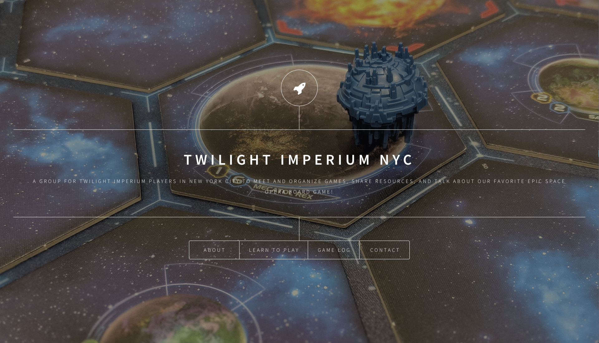
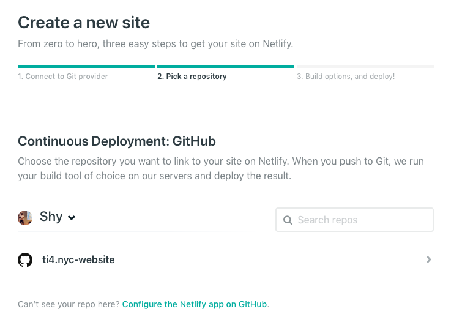
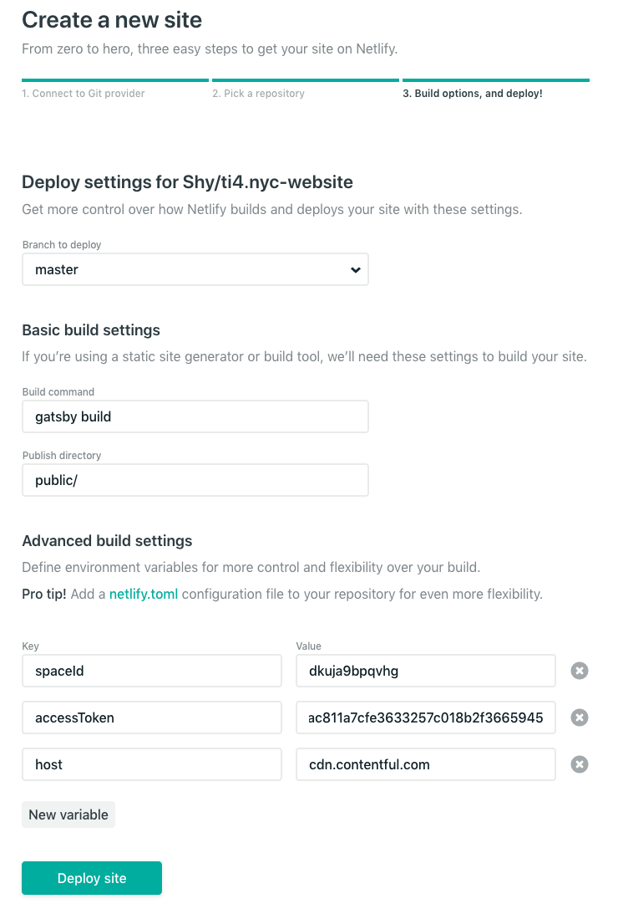
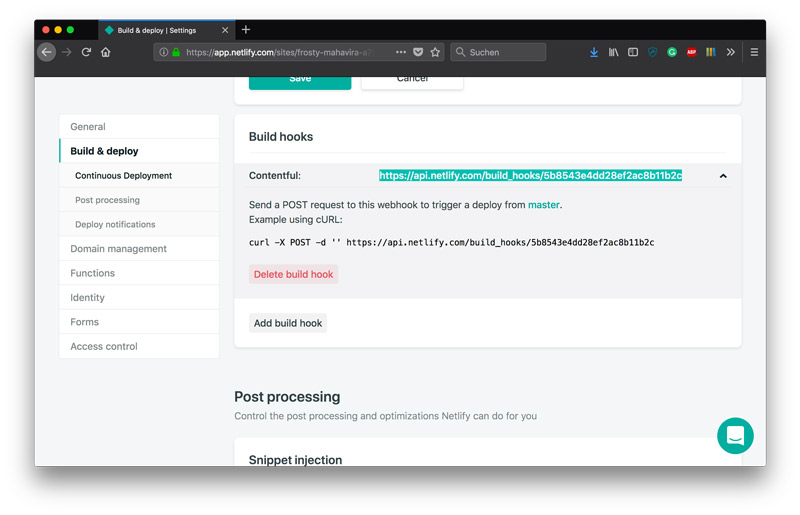
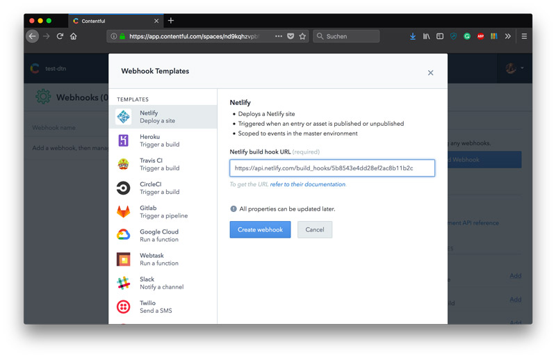

# TI4 NYC Website

This is [website](https://ti4.nyc/) to help organinze games of Twilight Imperium in NYC. It's forked from the [gatsby-starter-dimension](https://github.com/codebushi/gatsby-starter-dimension).



### Requirements

This site is created with [Gatsby](https://http://gatsbyjs.org/), hosted by [Netlify](https://www.netlify.com/) and with data handled in [Contentful](https://www.contentful.com/). To deploy this site you'll need a Contentful and Netlify account. If you don't have a Contentful account yet, you can register at [contentful.com/sign-up](https://www.contentful.com/sign-up/).

#### Get the source code and install dependencies.

Create a new site using this repo ([assuming Gatsby is installed](https://www.gatsbyjs.org/docs/)) by running from your CLI:

```
gatsby new ti4NYC https://github.com/Shy/ti4.nyc-website
```

Then launch a hot-reloading development environment accessible at localhost:8000.

```
cd ti4NYC
gatsby develop
```

#### Set up the content model and update the API Keys.

This project comes pre-connected to a live Contentful space. For you to be able to modify and evolve the project, you'll need to create your own Contentful space.

From the Contentful website click on the name of the space in the top left corner of the interface and select 'Add new Space'. Select the blank space option. Name your space, select its default locale (language) and the organization it should belong to. Then hit 'Create Space'.

To import the content model into your new space you'll need to install the [Contentful import tool](https://github.com/contentful/contentful-import).

```
npm install -g contentful-import
```

Once that's installed you'll be able to import the content model into your new space using the following command:

```
contentful-import \
  --space-id spaceID \
  --management-token managementToken \
  --content-file import_export/export.json
  ```

Make sure to update the .env file with your spaceID and accessToken. You're able to find both of those keys via app.contentful.com -> Space Settings -> API keys.

If utilizing the primary Contentful CDA leave the host as 'cdn.contentful.com', but if you'd prefer to utilize the [preview API](https://www.contentful.com/developers/docs/references/content-preview-api/), set the host to 'preview.contentful.com'

Additionally you can also optionally install the [TI4 UI extension](https://github.com/Shy/ti4.nyc-ui-extension) that goes along with this project to replace the JSON field with something more editor friendly.


#### Deploy the site on Netlify

If you don't have a Netlify account yet, you can register at [app.netlify.com/signup](https://www.app.netlify.com/signup). Additionally you'll need to fork this repository on GitHub.

Once logged into Netlify click New site from Git and connect to the previously forked repo.



Next in the advanced build settings add the environment variables for the `spaceId`,`accessToken`, and `host` to the variables created in the previous step. Once that's done hit deploy and Netlify will deploy a new site for you.



The last step in this process is to let Contentful trigger rebuilds in Netlify via webhooks. Grab the URL under "Settings" and "Build & Deploy" and get ready to connect Contentful with Netlify.



Go to the "Webhooks" section in the Contentful "Settings" and add a Netlify Webhook template in the sidebar or go the [short route](https://app.contentful.com/deeplink?link=webhook-template&id=netlify-deploy-site). Now when you publish new content on Contentful a rebuild of your site will trigger updating the gatsby site.


